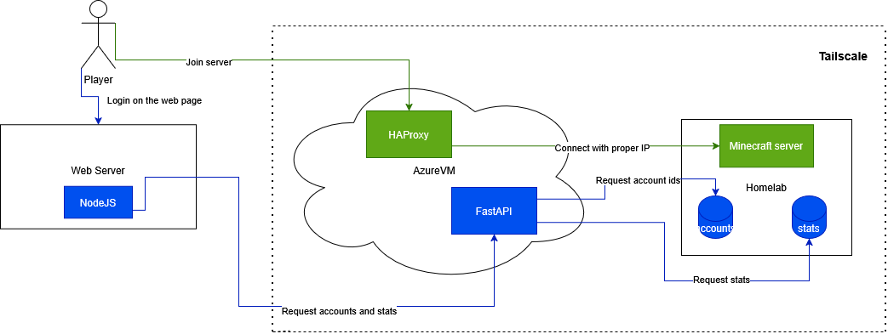

# noBS_Infrastructure
This repo contains documentation of my hybrid cloud Minecraft server infrastructure.

## Getting deep
### Web server
Frontend with NodeJS. Has multiple pages including login and stats page.
### AzureVM
Virtual machine hosted on azure. Links outer world with Minecraft server using Tailscale.
Contains:
- HAProxy: for preserving IP of player when connecting to the server.
- FastAPI: for getting and parsing data from the homelab without opening it to the world.
### Homelab
Server which currently sits at my home.
Contains:
- Minecraft Server: the main contributor to the everything that is listed here, runs on ubuntu.
- accounts.aof: file containing mapped Discord IDs to Minecraft UUIDs.
- stats.csv/stats.json: files containing player statistics and current online players.

## Traffic flows
### Playing on the server
Player enters IP of AzureVM to join a server -> HAProxy listens on the connecting port, preserves IP -> Tailscale receives player and tunnels it to homelab machine all using it's own IPs -> Homelab receives the player and lets him to join the Minecraft server.

### Logging and viewing statistics on the webpage
Player logins on the website -> NodeJS requests accounts and statistics from FastAPI inside the Azure -> FastAPI using Tailscale tunnels gets access to the files stored in HomeLab.
FastAPI returns parsed data to NodeJS -> NodeJS allows logging in, and shows the player data.

## Links
API repo: https://github.com/Sl0wYx/noBS_ServerAPI
